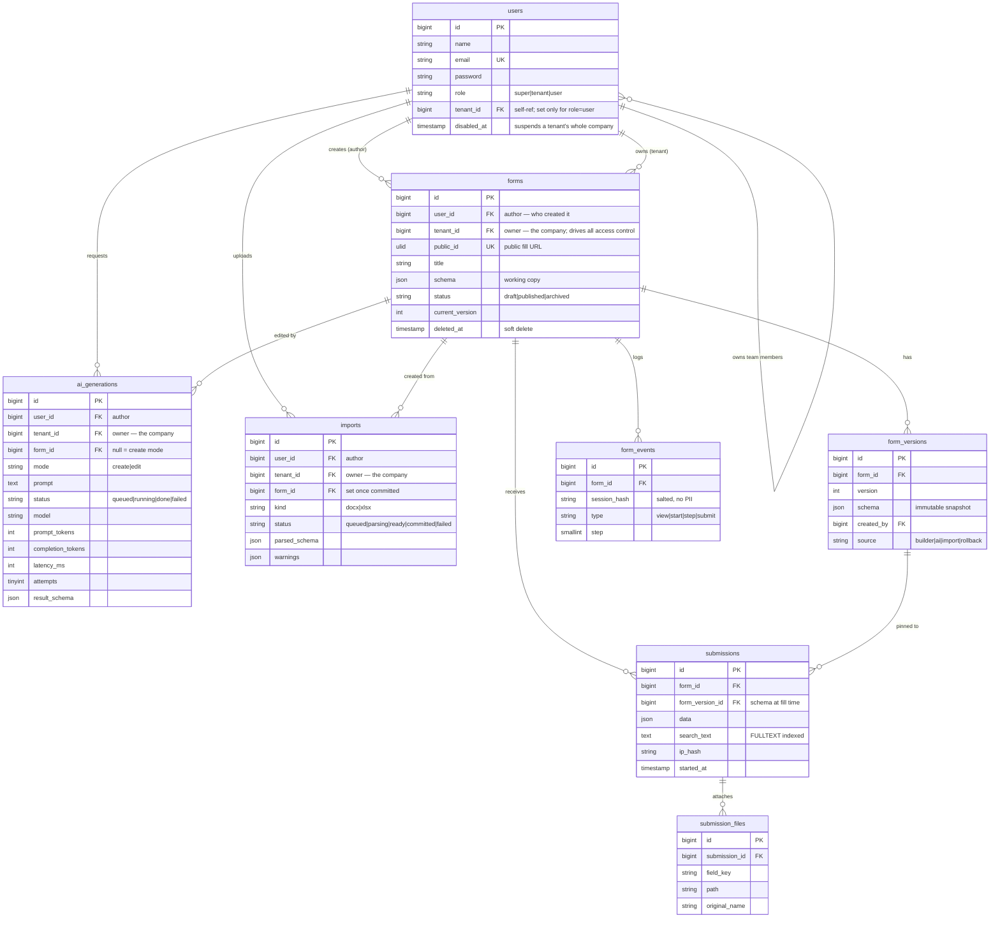

# AI-Powered Form Builder

Laravel 11 + React (Inertia.js) + Bootstrap 5 + MySQL 8. Manual drag-and-drop
form building, AI generation/editing via Google Gemini, and hybrid Word/Excel
import — all in one monolith, no separate frontend project.

> **Live demo:** [assignment.nammataxi.in](https://assignment.nammataxi.in) — shared hosting (cPanel/LiteSpeed), git-pull deploy, cron-driven queue worker.
>
> **Local demo credentials** (after seeding) — three roles, see [Roles & multi-tenancy](#roles--multi-tenancy):
> - Platform admin: `super@example.com` / `password`
> - Company owner: `tenant@example.com` / `password`
> - Team member: `user@example.com` / `password`

---

## Contents

- [Deployment status](#deployment-status)
- [Quick start (local)](#quick-start-local)
- [Environment variables](#environment-variables)
- [Architecture](#architecture)
- [Roles & multi-tenancy](#roles--multi-tenancy)
- [Database schema / ERD](#database-schema--erd)
- [API & route reference](#api--route-reference)
- [AI prompt strategy (Part B)](#ai-prompt-strategy-part-b)
- [Import strategy (Part C)](#import-strategy-part-c)
- [Part D — differentiators](#part-d--differentiators)
- [Testing](#testing)
- [Known limitations](#known-limitations)

---

## Deployment status

**Live** at [assignment.nammataxi.in](https://assignment.nammataxi.in) on
shared hosting (cPanel/LiteSpeed), 151 automated tests passing locally,
smoke-tested end-to-end in a real browser on both local and the live site.

What made this work on shared hosting (no Node.js, no SSH-based build step,
no Supervisor/Redis):

- `.env.example` is shared-hosting-aware (MySQL, database queue driver, no
  Redis/Horizon dependency).
- `public/build/` is committed straight to git (see the `.gitignore`
  comment on that line) since the server can't run `npm run build` itself —
  deploy is `git pull` only.
- Two cron jobs drive everything queue-related — see step 7 below.
- `database/sql/formbuilder.sql` is a full structure + seed-data dump —
  import it directly instead of running seeders on the host if `artisan` is
  restricted.

**If PHP < 8.2, cron is unavailable, or `exec`/`proc_open` are disabled** on
a target shared host, the documented fallback is Railway or Render (free
tier) — the codebase is host-agnostic; only the queue-worker mechanism
(cron vs. a long-running worker/Horizon) changes.

### Deploy steps (shared hosting)

**Deploy is git-pull-only** — the server has no Node.js, so the compiled
frontend can't be built there. `public/build/` is therefore committed to
git (see `.gitignore`'s comment on that line) rather than the more common
"gitignore it and build in CI" setup. **Every time frontend code changes,
rebuild locally and commit the result before pushing:**
```bash
npm run build
git add public/build && git commit -m "chore: rebuild assets"
git push
```
`vendor/` stays out of git — the server runs `composer install` itself.

1. **Pre-flight** (check in the hosting control panel first): PHP ≥ 8.2 CLI,
   Composer availability, MySQL 8/MariaDB with JSON column support, cron job
   access, `exec`/`proc_open` enabled. If any of these are missing, use the
   Railway/Render fallback instead.
2. Point the domain/subdomain **document root at `public/`** (or add a root
   `.htaccess` rewrite if the panel doesn't support a custom docroot).
3. On the server, over SSH:
   ```bash
   git clone <repo-url> .          # first time
   git pull                        # subsequent deploys
   composer install --no-dev --optimize-autoloader
   ```
   `public/build/` arrives with the `git pull` itself — no separate upload
   step needed, as long as it was rebuilt and committed locally first (see
   above).
4. Copy `.env.example` → `.env`, fill in `DB_*`, `APP_KEY` (`php artisan
   key:generate`), `APP_URL`, and `GEMINI_API_KEY`.
5. Import `database/sql/formbuilder.sql` via phpMyAdmin/CLI, **or** run
   `php artisan migrate --force` (+ `db:seed --force` for demo data) if SSH
   is available.
6. `php artisan storage:link` (or a small PHP script creating the symlink,
   if the artisan command is blocked by the host).
7. **Queue worker without Supervisor**: add two cron jobs (cPanel → Cron
   Jobs → Common Settings → "Once Per Minute"), both `* * * * *`:
   ```
   cd /path/to/app && /usr/local/bin/php artisan queue:work database --stop-when-empty --max-time=50 >> /dev/null 2>&1
   cd /path/to/app && /usr/local/bin/php artisan schedule:run >> /dev/null 2>&1
   ```
   Use the full path to the `php` binary (`which php` over SSH) — cron's
   `PATH` is not the same as an interactive shell's, so a bare `php` can
   silently fail to run. Without the first cron, AI generation and import
   jobs sit in the `jobs` table forever (`reserved_at` stays `NULL`) —
   check that table directly if generation/import ever seems stuck. This
   is *why* the queue driver is `database` and not Redis/Horizon — shared
   hosting has no persistent worker process.
8. Smoke-test: log in with the seeded demo account, create a form, generate
   one with AI, fill it publicly, check submissions/analytics.

**Subsequent deploys** are just: rebuild + commit assets locally → push →
`git pull` on the server → `composer install` if `composer.lock` changed →
`php artisan migrate --force` if new migrations landed.

---

## Quick start (local)

### Option A — Docker Compose (matches the brief's MySQL 8 requirement)

```bash
cp .env.example .env
docker compose up --build
# in another shell, once the app container is healthy:
docker compose exec app php artisan key:generate
docker compose exec app php artisan db:seed
```
App on `http://localhost:8000`. A `worker` container polls the database
queue exactly like the shared-hosting cron does (see Dockerfile/compose
comments) — it isn't Horizon on purpose, to keep dev parity with prod.

### Option B — native (PHP 8.2+, Node 18+, MySQL 8 or MariaDB)

```bash
composer install
npm install
cp .env.example .env
php artisan key:generate
# create the DB named in .env (DB_DATABASE=formbuilder by default), then:
php artisan migrate --seed
npm run build      # or `npm run dev` in a second terminal for HMR
php artisan serve
```

Queue jobs (AI generation, imports) need a worker running locally too:
```bash
php artisan queue:work
```

Run the test suite (uses an in-memory SQLite connection, see `phpunit.xml`):
```bash
./vendor/bin/pest
```

---

## Environment variables

| Variable | Purpose |
|---|---|
| `DB_*` | MySQL connection. Tests override to SQLite `:memory:` via `phpunit.xml`. |
| `QUEUE_CONNECTION` | `database` — chosen for shared-hosting compatibility (no Redis/Supervisor needed); cron drives it in prod. |
| `GEMINI_API_KEY` | Google Gemini key (free tier at [aistudio.google.com](https://aistudio.google.com/apikey)). Blank = AI generation fails with a clear message; import degrades ambiguous fields to `text` silently. |
| `GEMINI_MODEL` | Defaults to `gemini-flash-latest`. `gemini-2.0-flash` had zero free-tier quota on the API key used during development — verify quota on your own key before switching. |
| `GEMINI_TIMEOUT` | HTTP timeout (seconds) for a single Gemini call. |

Never commit a real `.env` — only `.env.example` is tracked.

---

## Architecture

```
Browser (React 18, single monolith, no separate frontend project)
   │  Inertia.js — no separate JSON API for the app's own pages
   ▼
Laravel 11 (routes/web.php → Controllers → Inertia::render)
   │
   ├── Schema core (app/Services/Schema) ── the single source of truth
   │     SchemaValidator   — JSON Schema 2020-12 + semantic checks
   │     SchemaNormalizer  — repairs near-miss AI/import payloads
   │     RuleCompiler      — schema → Laravel validation rules
   │     ConditionEvaluator— server twin of the client visibility logic
   │
   ├── Part B: AI (app/Services/Ai, app/Jobs/GenerateFormJob)
   │     GeminiClient → FormGenerator (parse/repair/retry) → SchemaValidator
   │     queued, polled from the UI — never blocks a request
   │
   ├── Part C: Import (app/Services/Import, app/Jobs/ParseImportJob)
   │     WordParser / ExcelParser (deterministic) → AiTypeResolver (assist)
   │     → SchemaNormalizer → SchemaValidator → preview/mapping UI
   │
   └── MySQL 8 (forms, form_versions, submissions, …) — see ERD below
```

**Why Inertia instead of a separate API + SPA:** the brief allows
"Livewire and/or React" and the user asked specifically for React inside the
Laravel app, not a separate frontend folder. Inertia gives React components
server-driven routing/controllers with no client-side router or duplicate
API layer — one HTTP request per navigation, same auth/session as Blade
would have.

**Why the JSON Schema is load-bearing, not decorative:** every write path —
the builder's canvas, the raw JSON editor, AI generation/edit output, and
both document importers — funnels through the same
`resources/schema/form-schema.json` + `SchemaValidator`. A schema that
doesn't validate is never persisted, from any path. This is also what makes
`RuleCompiler` possible: server-side validation on the public fill endpoint
is *derived from*, not duplicated from, the same source of truth.

---

## Roles & multi-tenancy

Three roles live in a single `users` table — no separate `teams`/`organizations`
table. A `role` column (`super` | `tenant` | `user`) plus a self-referencing
`tenant_id` column carry the whole model:

| Role | What they own | `tenant_id` | Landing page |
|---|---|---|---|
| **super** | Nothing — manages the platform | always `null` | `/companies` |
| **tenant** | A company/workspace — the existing form-builder feature set | `null` (a tenant *is* its own tenant) | `/forms` |
| **user** | Shares their tenant's forms — not a separate private dataset | their tenant-owner's `id` | `/forms` |

`User::tenantId()` resolves "which company does this account's data belong
to" (own id for a tenant, the `tenant_id` column for a user, `null` for a
super) and is the single value every policy check compares against. A
teammate has **full read/write access to their tenant's entire pool of
forms, AI generations and imports** — not just what they personally
created — which is the actual point of the feature: `forms`/`ai_generations`/
`imports` each carry a denormalized `tenant_id` column (see the indexing
rationale in the ERD section below), while `user_id` is kept as "who
personally created this record" for authorship display only, never for
access control.

**Account creation is closed, not open** — there is no public `/register`.
The only paths to a new account: a super is seeded once at setup; a super
creates/edits/disables company (tenant) accounts from `/companies`; a
tenant creates/edits/removes their own team members from `/team`.

**Disabling a company suspends it, it does not delete anything.** A super
"disabling" a company via `/companies` sets a `disabled_at` timestamp and
leaves every form, submission and team member untouched. While disabled:
logins for that company (the tenant and all their teammates) fail with a
specific "account disabled" message rather than a generic invalid-credentials
error, and the company's public fill URLs show the same "closed" screen an
archived form shows. Restoring clears `disabled_at` and everything works
again — no data is ever lost in either direction.

**Authorization boundary**: `FormPolicy`/`AiGenerationPolicy`/`ImportPolicy`
all compare `row.tenant_id === $user->tenantId()`; a `null` tenant id (a
super) never matches, so "a super owns zero forms" is a hard invariant, not
an accident of comparison semantics. Cross-tenant and cross-role failures
return `404` consistently across the new role-gated areas (`EnsureUserHasRole`
middleware, `TeamController`'s per-member guard) — the same "don't confirm a
resource exists" precedent `PublicFormController` already used for draft
previews. Policy-based `Form`/`AiGeneration`/`Import` authorization failures
still return Laravel's natural `403`.

---

## Database schema / ERD



### Indexes and why

| Table | Index | Reason |
|---|---|---|
| `users` | `role`, `(tenant_id, role)` | Companies list (`role=tenant`) and a tenant's team-member list both filter on these without a scan. |
| `forms` | unique `public_id` | O(1) lookup for the public fill URL — the hottest unauthenticated read path. |
| `forms` | `(tenant_id, status)` | The workspace dashboard filters by status without a table scan — was `(user_id, status)` before multi-tenancy; every teammate now sees the same list, so the index leads with the company, not the individual creator. |
| `form_versions` | unique `(form_id, version)` | Enforces one immutable snapshot per version number; also the natural lookup for rollback/diff. |
| `submissions` | `(form_id, id)`, `(form_id, created_at)` | Paginated listing, newest first, without sorting the whole table. |
| `submissions` | FULLTEXT `search_text` (MySQL/MariaDB only; LIKE fallback elsewhere) | Answer search across free-text fields without a separate search service. |
| `submissions` | `(form_id, ip_hash, created_at)` | Per-IP spam/rate-limit checks stay indexed. |
| `form_events` | `(form_id, type, created_at)` | Funnel aggregation (`COUNT(DISTINCT session_hash) GROUP BY type`) for the analytics dashboard. |
| `form_events` | `(form_id, session_hash, type)` | De-duplicates view/start beacons per session cheaply. |
| `ai_generations` / `imports` | `(tenant_id, status, id)` | The UI polls "our latest generation/import status" — indexed, not scanned. Denormalized onto each table rather than resolved via a join through `users`, so this exact index shape survives multi-tenancy unchanged; see [Roles & multi-tenancy](#roles--multi-tenancy). |

---

## API & route reference

All routes are session-authenticated (Breeze) except the `/f/{publicId}`
group. Inertia page routes return full pages; the rest return JSON for
client-side polling. Routes marked **super** or **tenant** are additionally
gated by the `role:` middleware — see [Roles & multi-tenancy](#roles--multi-tenancy).

| Method | Route | Purpose |
|---|---|---|
| `GET` | `/companies` **(super)** | List companies (tenant accounts) |
| `POST` | `/companies` **(super)** | Create a company |
| `PUT` | `/companies/{tenant}` **(super)** | Edit a company's name/email/password |
| `DELETE` | `/companies/{tenant}` **(super)** | Disable a company — suspends, never deletes data |
| `POST` | `/companies/{tenant}/restore` **(super)** | Re-enable a disabled company |
| `GET` | `/team` **(tenant)** | List this company's team members |
| `POST` | `/team` **(tenant)** | Add a team member |
| `PUT` | `/team/{member}` **(tenant)** | Edit a team member |
| `DELETE` | `/team/{member}` **(tenant)** | Remove a team member |
| `GET` | `/forms` | Paginated list of the current tenant's forms (shared across teammates) |
| `GET` | `/forms/create` , `/forms/{form}/edit` | 4-step builder wizard (create / edit) |
| `POST` | `/forms` , `PUT /forms/{form}` | Validate schema → save → append version |
| `DELETE` | `/forms/{form}` | Soft delete |
| `GET` | `/forms/{form}/versions` | Version history + field-level diffs |
| `POST` | `/forms/{form}/versions/{version}/rollback` | Append the old snapshot as a **new** version |
| `GET` | `/forms/{form}/analytics` | Funnel, trend, drop-off, median fill time |
| `GET` | `/forms/{form}/submissions` | Paginated + searchable submissions |
| `GET` | `/forms/{form}/submissions/export` | Streamed CSV export |
| `GET` | `/submission-files/{file}` | Authorized file download |
| `GET` | `/ai/generate` | Standalone "describe your form" page (create-from-prompt entry point) |
| `POST` | `/ai/generations` | Queue an AI create/edit job → `{id}` |
| `GET` | `/ai/generations/{id}` | Poll status/result/stats (JSON) |
| `GET` | `/import` | Import upload screen |
| `POST` | `/import` | Upload .docx/.xlsx → queue `ParseImportJob` → `{id}` |
| `GET` | `/import/{id}` | Poll parse status/result (JSON) |
| `POST` | `/import/{id}/commit` | Commit the (edited) mapping as a new draft form |
| `GET` | `/f/{publicId}` | Public fill page (draft = owner-only preview, archived = closed notice) |
| `POST` | `/f/{publicId}` | Submit (rate-limited, honeypot, min-fill-time, daily cap) |
| `POST` | `/f/{publicId}/event` | Analytics beacon (`start`/`step`) |

---

## AI prompt strategy (Part B)

**System prompt** (`FormGenerator::systemPrompt()`) hard-codes the output
contract: exact JSON shape, the enumerated list of allowed field types
(kept in sync with `FieldTypes::all()`, not duplicated by hand), and the
rule that choice fields need ≥2 options. Gemini is called with
`responseMimeType: application/json` (JSON mode), `temperature: 0.2` for
consistency.

**Create vs. edit.** Create mode sends only the user's prompt. Edit mode
serializes the form's *current* schema into the user prompt and instructs
the model to return the **full updated schema**, preserving existing
ids/keys for anything it doesn't intend to change — this is what makes
"add an emergency contact section" or "make phone required" work without
a diffing/patching protocol.

**Handling hallucinated field types.** The model sometimes emits types
that aren't in the contract (`"tel"`, `"select_one"`, `"scale"`, …).
`SchemaNormalizer` resolves these through `FieldTypes::ALIASES` — a
maintained map of near-miss names to canonical types — before validation
even runs. Anything still unrecognized falls back to `text` with a
recorded warning; the schema is never rejected outright for this reason
alone.

**Retries and fallbacks.** `FormGenerator::run()`:
1. Calls Gemini, capturing latency + token usage regardless of outcome.
2. Parses the reply tolerantly — strips markdown code fences, falls back
   to the widest `{...}` span for prose-wrapped replies, strips trailing
   commas — before giving up on that attempt.
3. Runs the parsed object through `SchemaNormalizer` → `SchemaValidator`.
4. If invalid, the **validator's own error list** is fed back to the model
   as corrective instruction and the whole cycle retries (max 3 attempts
   total).
5. If still invalid after 3 attempts, or the HTTP call itself fails (bad
   key, rate limit, network), the generation is marked `failed` with a
   human-readable error. **A broken schema is never written to
   `ai_generations.result_schema`, let alone to a real form** — the
   builder's "Apply to canvas" button only appears once a generation is
   `done`.

**Never blocking a request.** `POST /ai/generations` only creates a DB row
and dispatches `GenerateFormJob` — it returns immediately. The builder UI
polls `GET /ai/generations/{id}` every 2 seconds and shows queued →
running → done/failed, plus the model, attempt count, token usage and
latency once finished.

---

## Import strategy (Part C)

**The hybrid split, explained.** Deterministic parsing runs first and is
authoritative wherever the document gives a strong signal — heading
styles, question-mark-terminated lines, `(required)` markers, checkbox
glyphs, list items, explicit `(email)`-style hints, and two-column tables
all map directly to schema constructs with no model call involved. AI is
invoked **once per import**, batched, and only for the labels the
deterministic pass could not classify (`TypeInferrer` returns `null`) —
this keeps imports fast, cheap, and reproducible; a `.docx` with only
common field labels (name, email, phone…) never touches the network. If
the AI call fails for any reason, those fields simply stay `text` with a
warning — import never hard-fails because of the AI step.

**Word (.docx):** the first Heading becomes the form title; further
Headings start new sections. Lines ending in `?` or `Label:` become
fields. `(required)` / trailing `*` sets the required flag. A trailing
`(type)` hint (e.g. `Upload your resume (file)`) overrides inference.
List items and `☐`/`□` bullet lines immediately following a question
become its options (radio if plain list, checkbox if checkbox glyphs).
Two-column tables produce one field per row. Anything left over — stray
prose, decorative text — is reported as an "unparseable block" warning
rather than silently dropped.

**Excel (.xlsx), two documented layouts:**
- **Template layout** — a header row containing `Label` and `Type`
  triggers this path: `Label | Type | Required | Options | Help |
  Placeholder`, one field per row, `Options` split on `;`/`,`.
- **Plain header-row layout** — any other sheet: each header cell becomes
  a field, and up to 5 data rows are sampled per column to infer type
  (all-valid-emails → `email`, all-numeric → `number`, date-shaped strings
  → `date`, ≤3 distinct repeated values across ≥4 rows → `dropdown` with
  those values as options).

**Preview and mapping, always.** Neither parser writes a form directly —
`ParseImportJob` produces a `parsed_schema` on the `imports` row, and the
React mapping screen (`Pages/Import/Wizard.jsx`) shows every detected
field with an editable label, a type dropdown, a required checkbox, and a
delete button, plus any parser/AI warnings, before the user clicks
"Create form". The committed form starts as a **draft** with version
`source = import`, so nothing is public until reviewed.

**Defensiveness.** Both parsers are wrapped in try/catch and degrade to a
`warnings`-only result rather than throwing on a corrupt/unexpected file;
tests include a non-Word file passed to `WordParser` and a genuinely
empty spreadsheet. Sample files actually used in testing are committed
under [`samples/`](samples/) (`job-application.docx`,
`event-feedback.docx`, `fields-template.xlsx`, `header-row.xlsx`) —
regenerate them anytime with `php scripts/make-samples.php`.

---

## Part D — differentiators

Three picked; each has a full write-up in [DECISIONS.md](DECISIONS.md):

1. **Form versioning + rollback** — every save/AI-apply/import-commit
   appends an immutable snapshot; submissions pin to the version they
   were filled against; rollback creates a *new* version rather than
   rewriting history.
2. **Conditional logic & branching** — per-field show/hide rules
   (all/any + 7 operators), evaluated live in React on the fill page and
   re-verified server-side (`ConditionEvaluator`) so hidden fields can
   never be required or have their stale values persisted.
3. **Analytics + spam protection** — a funnel/trend/drop-off dashboard
   from anonymous session-hash beacons (no cookies, no PII), paired with
   layered spam defenses on the public fill endpoint: per-IP+form rate
   limiting, a honeypot field, an encrypted minimum-fill-time token, and
   a per-form daily submission cap.

---

## Testing

```bash
./vendor/bin/pest                 # 151 tests, ~596 assertions, in-memory SQLite
./vendor/bin/pest --coverage      # requires Xdebug/PCOV
```

Coverage includes: the schema validator/normalizer/rule-compiler/condition
evaluator (unit), the full builder CRUD + versioning + authorization
(feature), the public fill path including every spam guard and file
uploads (feature), the AI pipeline against a mocked Gemini client covering
happy path, fenced/prose JSON, hallucinated types, retry-on-feedback,
exhaustion, and transport failure (feature), both document parsers against
the committed samples plus hostile inputs (unit + feature), and the
analytics aggregation queries (feature).

---

## Known limitations

- **No Redis/Horizon** — a deliberate choice, not an oversight. Both are
  listed in the brief as "positive signals" (bonus, not required) alongside
  a separate Python FastAPI AI service and Docker; three differentiators
  were already picked for Part D (see
  [Part D — differentiators](#part-d--differentiators)), and Redis/Horizon
  specifically need a persistent background process with root/daemon
  access, which the target shared-hosting environment (cPanel, no root)
  does not offer. The queue driver is `database`, driven by a cron job
  (see [Deployment status](#deployment-status)) — this is what actually
  runs reliably on that host, at the cost of a worst-case ~1 minute delay
  before an AI generation or import starts processing (the cron only runs
  once a minute), versus a Redis-backed worker picking jobs up
  immediately. Swapping to Redis/Horizon later needs no code change, only
  `QUEUE_CONNECTION=redis` + a host that can run a persistent worker.
- **Seeding on the live server needs `composer install` without
  `--no-dev`.** `fakerphp/faker` is in `require-dev`; if the host was
  provisioned with `--no-dev`, `php artisan db:seed` fails with `Class
  "Faker\Factory" not found`. Either re-run `composer install` (no flag)
  before seeding, or import `database/sql/formbuilder.sql` directly
  instead, which needs no seeder at all.
- **Company disable is manual, no billing/plan tied to it.** A super can
  suspend a company from `/companies`, but there's no automated trigger
  (unpaid invoice, trial expiry) — that layer doesn't exist yet.
- **No self-service signup.** Every account is provisioned by a super
  (companies) or a tenant (team members) — there's no public `/register`
  by design, so onboarding a brand-new company always requires a super
  admin action first.
- **CSV export streams synchronously** rather than as a queued job; fine
  at the data volumes a grading pass will generate, but a form with
  hundreds of thousands of submissions would want a queued export with a
  download-when-ready notification instead.
- **No i18n framework** — the AI can translate a form's *labels* on
  request ("translate labels to Hindi"), but the builder chrome itself is
  English-only.
- **FULLTEXT search requires MySQL/MariaDB**; the SQLite path used by the
  automated test suite falls back to `LIKE`, which is correct but not
  representative of production search relevance/ranking.
